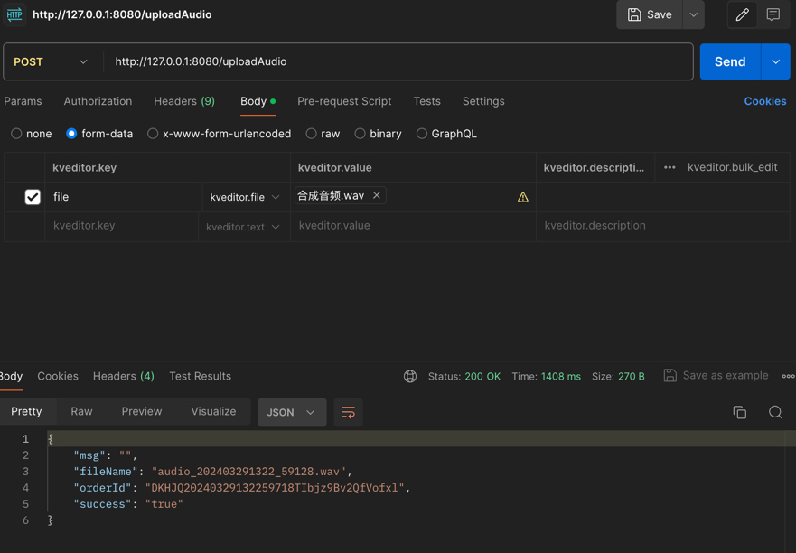

## 说明
后台启动，接口本身不对外

http://127.0.0.1:8080/uploadAudio
***

流程是：

1，接受音频文件

2，文件本地保存

3，上传科大讯飞语音转写接口，并将orderid存入db，状态 0：进行中

4，此时返回成功信息，页面可以显示等待转换结果

5，后台每7秒查询一次返回结果（后续改成回调url）

6，将结果存入db，状态 1：完成（状态 2：错误）
*** 

调用方式如图，确保form-data形式，文件file。


返回值：
```
{
    "msg": "",
    "fileName": "audio_202403291334_06085.wav",
    "orderId": "DKHJQ20240329133406518800gt5AoGtwQleQI",
    "success": "true"
}
```
因为识别本身是异步的，通过orderId去db获取识别结果
